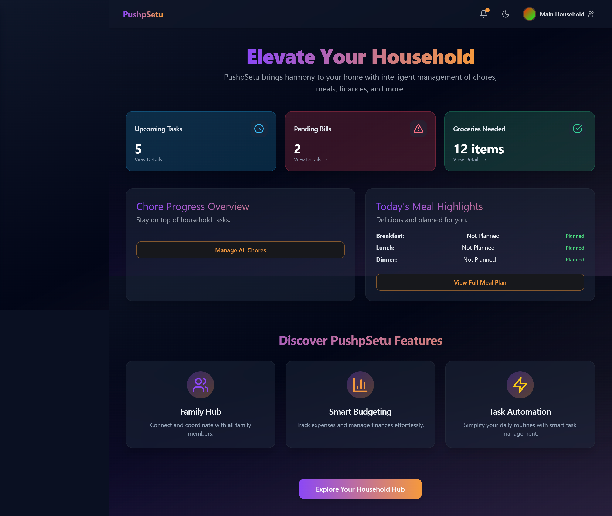
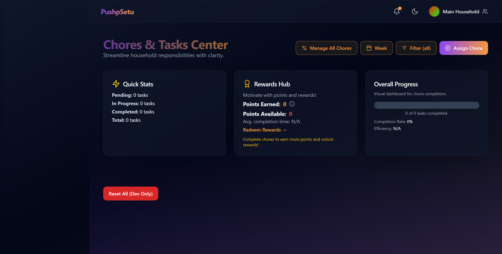
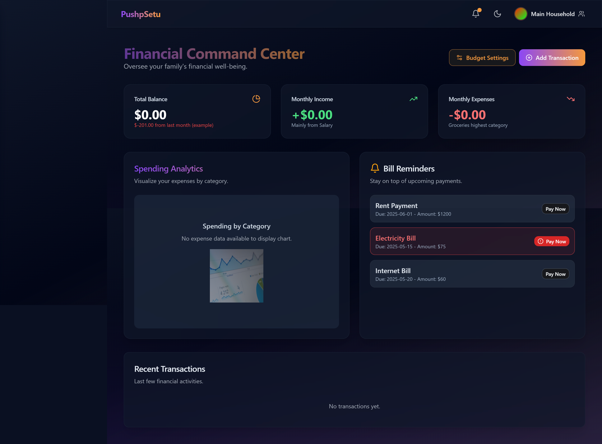

 <p align="center">
  
</p>

<p align="center">
  
  
  
</p>

---

## ⚡ Overview

**PUSHP SETU** is a futuristic **House Management System** designed to simplify and smarten how you manage your household. Whether you're tracking chores, monitoring expenses, or organizing inventory, PUSHP SETU provides an elegant and responsive interface to streamline your daily life.

> 👨‍👩‍👧‍👦 Empower your home with digital efficiency.

---

## 🌐 Live Preview

🔗 [**View Demo**](https://pushp-setu.netlify.app/) 

------
| Dashboard |
|-----------|
|  |
|  |
|  |
|  |

------
## 🌟 Key Features

✅ 🧹 Task & Chore Management  
✅ 💸 Household Expense Tracker  
✅ 📦 Inventory & Supplies Monitor  
✅ 📝 Custom Reminders & Notes  
✅ 🧠 Multi-user Friendly Interface  
✅ ⚙️ Lightweight and fast frontend (Vite + Tailwind)

---

## 🛠️ Tech Stack

| Technology    | Description                             |
|---------------|-----------------------------------------|
| **HTML5**     | Structural layout                       |
| **Vite**      | Ultra-fast frontend build tool          |
| **Tailwind CSS** | Utility-first responsive UI framework |
| **PostCSS**   | CSS transformations and optimizations   |

---

## 📦 Installation

```bash
# Clone the repository
git clone https://github.com/AMANPUSHP23/Pushp-Setu.git

# Navigate to project directory
cd pushp-setu

# Install dependencies
npm install

# Start development server
npm run dev

# Build for production
npm run build

# Preview production build
npm run preview

🤖 Future Enhancements
🔐 User Authentication

📊 Analytics Dashboard

🛎️ Push Notification Reminders

📱 Mobile-first PWA version

🧠 Contributing
We welcome your ideas and contributions!

# Fork the repository
# Create your branch: git checkout -b feature/MyFeature
# Commit changes: git commit -m 'Add my feature'
# Push branch: git push origin feature/MyFeature
# Submit a pull request ✅


📄 License
Licensed under the MIT License.

🤝 Contact
Aman Pushp
[**Aman Pushp**](https://github.com/AMANPUSHP23)
📫 amanpushp2001@gmail.com

